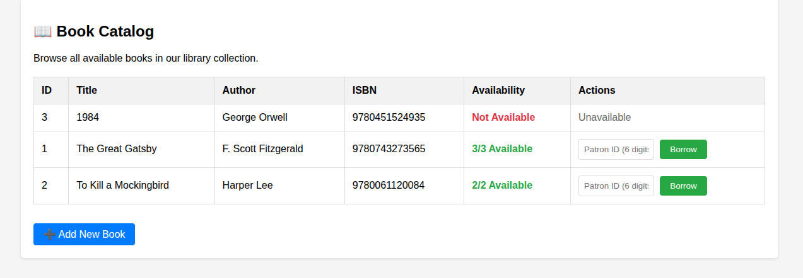
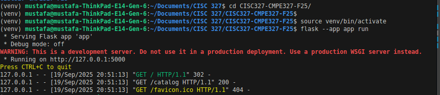
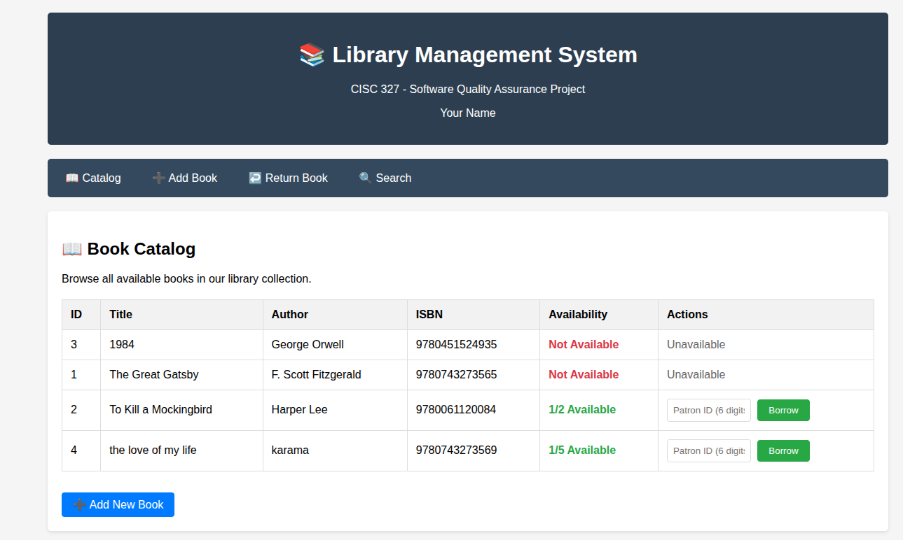
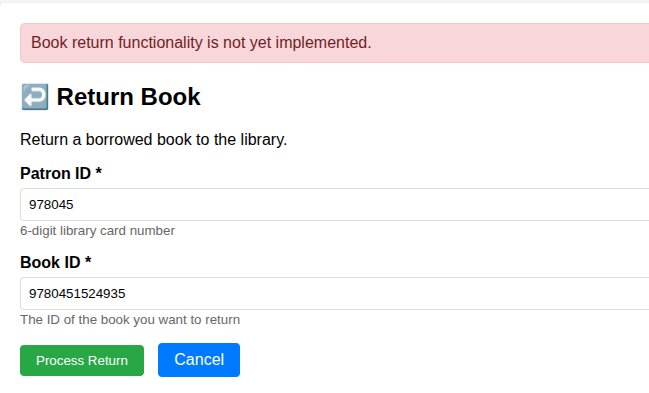
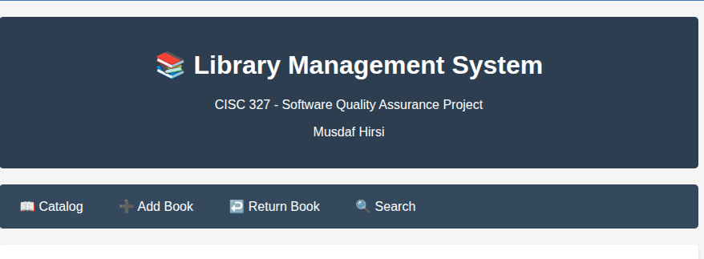

Assignment 1 Report – Library Management System

Name: Musdaf Hirsi
Student ID: 20376847

1. Environment Setup

Cloned the project repository to my computer.

Created and activated a Python virtual environment.

Installed dependencies with pip install -r requirements.txt.

Ran the application with flask --app app run.

Verified the app works by visiting http://127.0.0.1:5000/catalog

 SScreenshots included in submission:

**Catalog page:**  
  

**Terminal after running Flask:**  
  

**After adding a book:**  
  

**After trying to return a book:**  
  

**Banner change (showing my name):**  
  

2. Project Implementation Status

| Function Name       | Implementation Status   | What I Observed / What is Missing |
|---------------------|-------------------------|-----------------------------------|
| add_book()          | Complete                | Able to add a new book and it appears in catalog. |
| borrow_book()       | Partial                 | Works if you enter any 6-digit Patron ID (no validation). Does not check if patron already borrowed the same book. |
| search_books()      | Not working             | Search function does not return results even for books that exist. |
| return_book()       | Partial / Unstable      | Worked once when tested, but stopped working consistently afterwards. |
| calculate_late_fee()| Backend only (not in UI)| API endpoint exists at `/api/late_fee/<patron>/<book>`, but backend not implemented (returns 501). Requires unit test or API call. |
| list_catalog()      | Complete                | Works at `/catalog`, shows all books with availability correctly. |
| api_search()        | Partial                 | API endpoint works at `/api/search?q=term&type=title`, but often returns empty results. Not linked to UI. |
     

3. 3. Unit Tests Summary

We created 20 tests across all requirements (R1–R7) using pytest.  
Results are as follows:

- **R1: Add Book** 
  - Invalid ISBN → correctly rejected.  
  - Empty title → correctly rejected.  
  - Author name too long → correctly rejected.  
  - Invalid number of copies → correctly rejected.  
  - (Valid input fails in sample_test.py, showing that the insert is not functioning correctly.)

- **R2: Borrow Book**  
  - Invalid patron ID → rejected.  
  - Empty patron ID → rejected.  
  - Nonexistent book ID → rejected.  
  - Non-digit patron ID → rejected.  

- **R3: Return Book**  
  - Always returns “not yet implemented.”  
  - All tests confirm it is incomplete.  

- **R4: Late Fee**  
  - Function exists but always returns `None` or “not implemented.”  
  - Confirmed incomplete.  

- **R5: Search Books**  
  - Returns list in all cases.  
  - Works for nonsense input, empty string, title, and author searches (but results are empty).  

- **R6: Catalog List**  
  - `get_all_books` function exists.  
  - Returns a list when database is connected, otherwise skipped.  

- **R7: Patron Status Report**  
  - Always returns `{}`.  
  - Tests confirm it is incomplete.  

**Overall:** 21 tests run (20 passed, 1 failed).  
The single failure was from `sample_test.py::test_add_book_valid_input`, which shows the add book functionality is buggy.  
